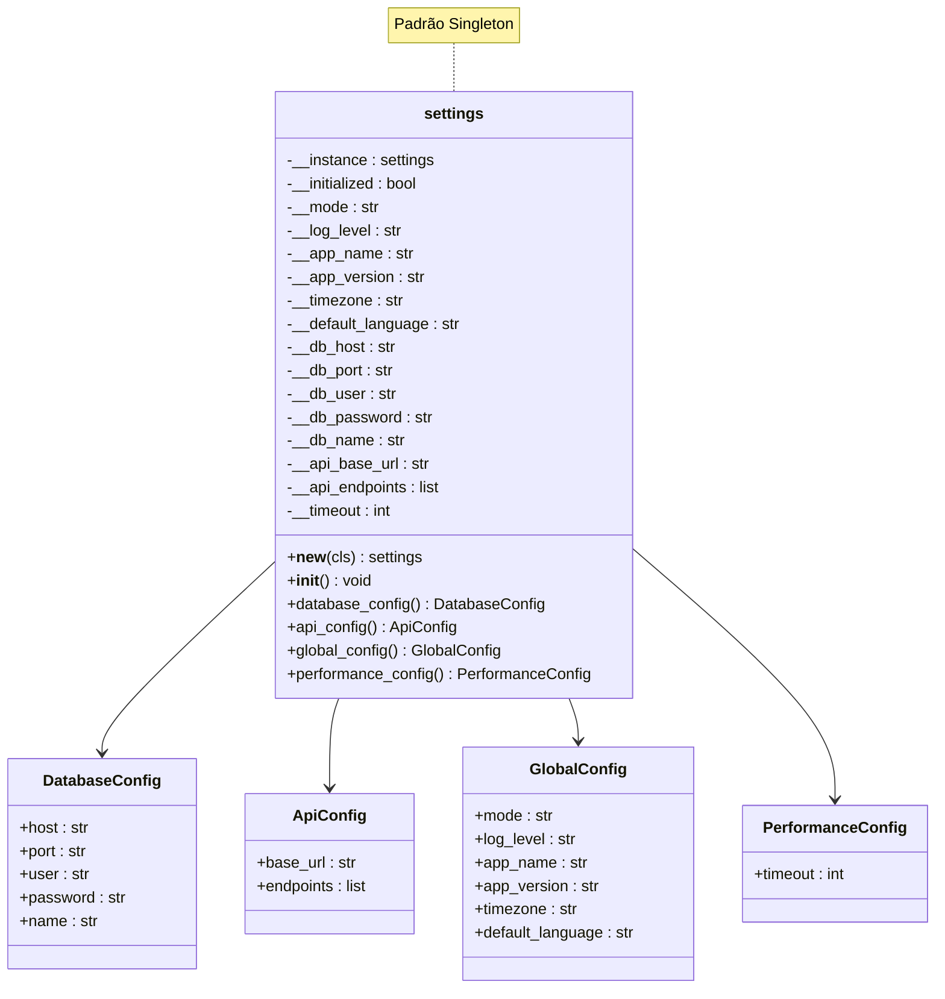

```mermaid
classDiagram
    class settings {
        -__instance : settings
        -__initialized : bool

        -__mode : str
        -__log_level : str
        -__app_name : str
        -__app_version : str
        -__timezone : str
        -__default_language : str

        -__db_host : str
        -__db_port : str
        -__db_user : str
        -__db_password : str
        -__db_name : str

        -__api_base_url : str
        -__api_endpoints : list

        -__timeout : int

        +__new__(cls) settings
        +__init__() void

        +database_config() DatabaseConfig
        +api_config() ApiConfig
        +global_config() GlobalConfig
        +performance_config() PerformanceConfig
    }

    class DatabaseConfig {
        +host : str
        +port : str
        +user : str
        +password : str
        +name : str
    }

    class ApiConfig {
        +base_url : str
        +endpoints : list
    }

    class GlobalConfig {
        +mode : str
        +log_level : str
        +app_name : str
        +app_version : str
        +timezone : str
        +default_language : str
    }

    class PerformanceConfig {
        +timeout : int
    }

    settings --> DatabaseConfig
    settings --> ApiConfig
    settings --> GlobalConfig
    settings --> PerformanceConfig
    note for settings "Padrão Singleton"
```
