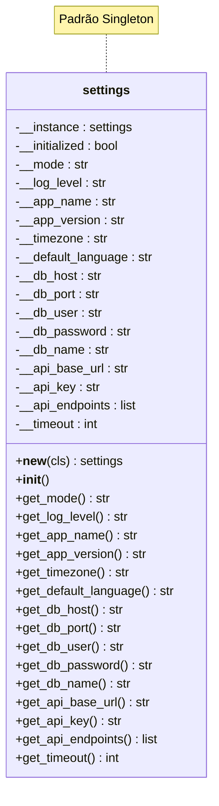

```mermaid
classDiagram
  class settings {
    -__instance : settings
    -__initialized : bool
    -__mode : str
    -__log_level : str
    -__app_name : str
    -__app_version : str
    -__timezone : str
    -__default_language : str
    -__db_host : str
    -__db_port : str
    -__db_user : str
    -__db_password : str
    -__db_name : str
    -__api_base_url : str
    -__api_key : str
    -__api_endpoints : list
    -__timeout : int
    +__new__(cls) settings
    +__init__()
    +get_mode() str
    +get_log_level() str
    +get_app_name() str
    +get_app_version() str
    +get_timezone() str
    +get_default_language() str
    +get_db_host() str
    +get_db_port() str
    +get_db_user() str
    +get_db_password() str
    +get_db_name() str
    +get_api_base_url() str
    +get_api_key() str
    +get_api_endpoints() list
    +get_timeout() int
  }
  note for settings "Padrão Singleton"
```