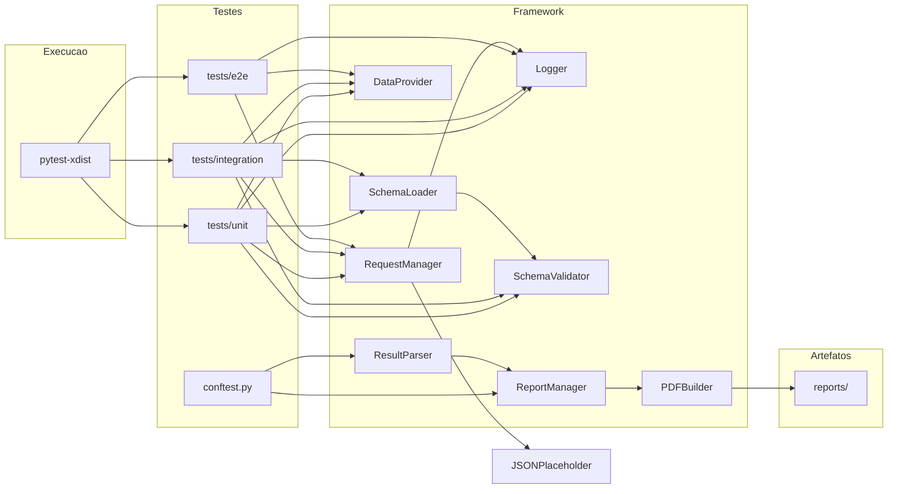
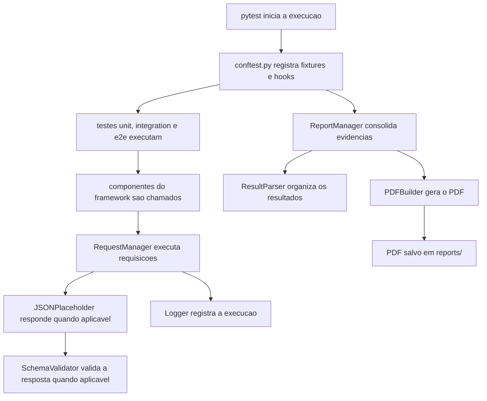
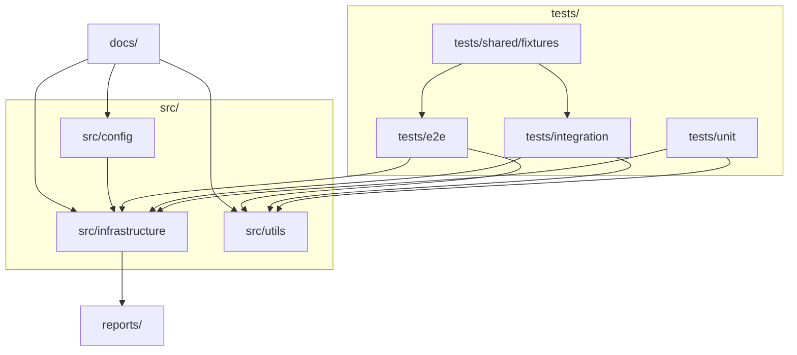

# Arquitetura Atual do Framework

Este documento consolida a arquitetura atual do framework para a demo final da Issue #32.

Os arquivos `.drawio` e `.png` existentes em `docs/architecture/` continuam como historico visual do projeto. Este arquivo em Markdown com Mermaid representa a visao consolidada mais atual do framework, considerando `schema validation`, `report manager` e execucao paralela com `pytest-xdist`.

## 1. Diagrama geral da arquitetura

## 2. Diagrama de fluxo de execucao

## 3. Diagrama de modulos e componentes

## 4. Observacoes arquiteturais relevantes

- `tests/unit`, `tests/integration` e `tests/e2e` representam a organizacao funcional atual da suite.
- `conftest.py` participa do fluxo de coleta e geracao de relatorios.
- `RequestManager`, `Logger` e `DataProvider` continuam como componentes centrais de apoio aos testes.
- `SchemaLoader` e `SchemaValidator` representam a camada de validacao de contrato adicionada recentemente.
- `ReportManager`, `ResultParser` e `PDFBuilder` representam a cadeia de geracao de evidencias em PDF.
- `JSONPlaceholder` permanece como dependencia externa usada por parte da suite.
- `pytest-xdist` representa a estrategia atual de execucao paralela recomendada para o projeto.
